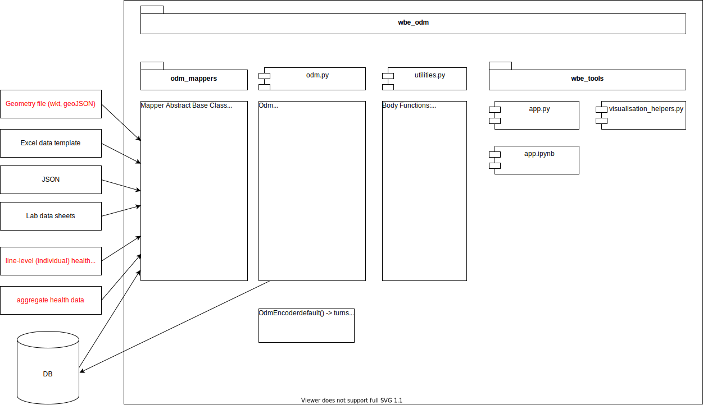

# Open Wastewater Data Model Reader

This repository is meant to hold resources to help researchers manipulate wastewater-based epidemiology data that conforms to the [Open Data Model](https://github.com/Big-Life-Lab/covid-19-wastewater/) for the surveillance of the SARS-CoV-2 virus in wastewater.

The code included in this repository will let you:

1. Get data into the data model format using mappers;
2. Validate your data;
3. Visualize data;
4. Perform common manipulations.

## Repo structure

* `wbe_odm`: The package where most of the code is located.

* `tests`: Where the test code is located.

* `Data`: Location of example data files.

* `notebooks`: Location of Jupyter Notebooks that use the `wbe_odm` package for different purposes (e.g., reading in data from different sources, making plots, etc.)

## Package structure

The `wbe_odm` package has the following structure:

The larger rectange represents the `wbe_odm` package or directory. This is where the code base lives.

### `odm.py` module

The `odm.py` module contains the `Odm` object.
The `Odm` object is a python data class meant to hold the same data as the Open Data Model, using the same tables. In the `Odm` object, tables are stored as pandas DataFrames.

`Odm` objects also have helper methods to manipulate and tranform their own data:

* `load_from` lets an empty `Odm` object take in data from an object of the [mapper class.](###Mapper-Class)
* `append_odm` appends tables from an `Odm` objects and add it to the calling object.
* `append_from` appends tables from objects of the [mapper class.](###Mapper-Class) and add it to the calling object.
* `to_csv` saves the tables inside the `Odm` object in `.csv` files.
* `to_parquet` saves the tables inside the `Odm` object in `.parquet` files.
* `to_sqlite3` adds the data inside the `Odm` object to the right tables inside a sqlite3 database.
* `combine_per_sample` creates a wide table (one row = one sample) with all characteristics recored in the other tables of the data model.

* `get_geoJSON` returns a geoJSON representation of the data held in the `polygon` table of the data model.

The module also includes a `OdmEncoder` object which turns `Odm` objects into a JSON string.

### `odm_mappers` sub-package

The data needed to do Wastewater-based surveillance come in many shapes and formats. To help researchers gather all that data into the ODM format, mapper obejcts can be used to parse, type-cast and organize data from any source. and then load that data into a single `Odm` object. This repo contains the following mappers:

* `BaseMapper`: this is an abstract mapper that all other mappers should inherit from. It has one required method:
  * `read`: this method is called by the user to get data from an input source. Any number of arguments can be used.
  `BaseMapper` also has two methods that can be inhereited or overridden by all mappers:
  * `validates`: this method is called by the `Odm` object before trying to ingest data from a mapper.
  * `type_cast_table` is a utility used to ensure that the columns of each tables conform to the data type defined by the ODM.

* `ExcelTemplateMapper` reads data from the long version of the official [Excel Data Template from the Open Data Model](https://github.com/Big-Life-Lab/covid-19-wastewater/blob/main/template/Data%20Model%20-%20Quebec%20Template%20v1.1.xlsx)

* `Sqlite3Mapper` loads the contents of a sqlite3 database.
* `SerialzedMapper` reads JSON strings generated by the `OdmEncoder` object.
In addition to these general-purpose mappers, the subpackage contains mappers that are designed for specific, local data sources. These can be used as inspiration for the development of more mappers for other locales.

* `modelEauMapper` reads in data from the [model*EAU*](https://github.com/modelEAU) lab for wastewater sample characterization.
* `VdQPlantMapper` reads data from the internal site measurement data sheet for the Ville de Québec wastewater treatment plants.
* Finally, `McGillMapper` reads the laboratory data sheet developped at McGill University to track the processing and analysis of wastewater samples for viral detection. This mapper is further explained in `mcgill_mapper.md`

### `utilities.py` module

This modules contains helper functions to help other functions run.

### `wbe_tools` subpackage

This subpackage contains the following
___

## How to use this package

### Installing the package

1. Get to the root of the repo using your terminal.
2. Activate your python environment of choice.
3. Enter the command `pip install -e .` (the dot is important)
4. The package should now be installed. You can therefore import it just like any other package using the statement `import wbe_odm`

### Odm Class

### Mapper Class

### WBE Tools

### Sample Data

### Notebooks
